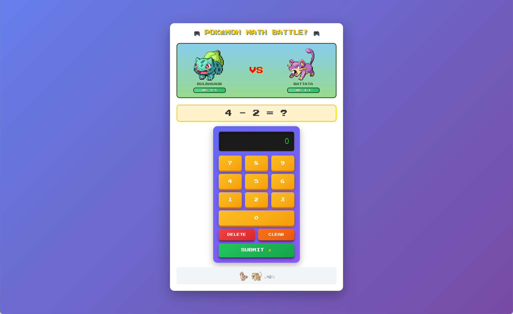

# Pokémon Math Battle!

**[Play it now!](https://bryanesmith.github.io/pokemon-math-battle/)**    

Single-page web application where kids fight Team Rocket by solving addition and subtraction problems. Fight and collect base, evolved, and legendary Pokemon as you go!  (Ages 6+)

Sprites from [PokéAPI Sprites](https://github.com/PokeAPI/sprites). Created with **Claude Sonnet 4.5**.
